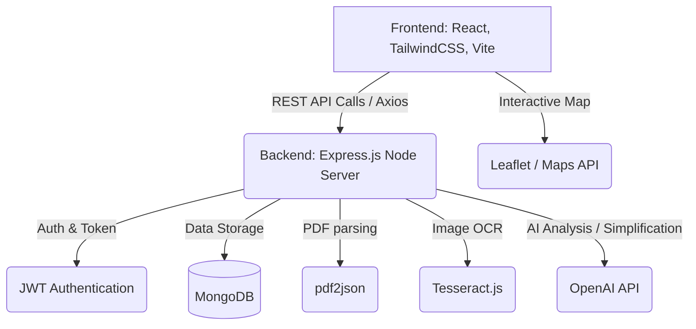

# 1. Title Page

**MedVision AI**
**Comprehensive Project Documentation**

**Submitted by:** [Your Name / Team]
**Year:** 2025-2026

*Note regarding Formatting in Microsoft Word:* 
*Please apply the following styles when printing/exporting to Word:*
- *Font:* Liberation Serif or Calibri
- *Main Title:* 16–18 pt (Bold)
- *Chapter Title:* 16 pt (Bold)
- *Section Heading:* 14 pt (Bold)
- *Sub-section Heading:* 12 pt (Bold)
- *Normal Text:* 12 pt
- *Table / Figure Text:* 10–11 pt
- *Line Spacing:* 1 line
- *Alignment:* Justified (Main Text), Left (Headings), Center (Title page & Page numbers)

---

# 2. Certificate

This is to certify that the project entitled **"MedVision AI"** is a bonafide work carried out by **[Your Name/Team]** in partial fulfillment for the award of the degree/diploma in [Course Name]. The project has been completed successfully and is ready for evaluation.

**Signature of Guide/HOD** 

---

# 3. Abstract

MedVision AI is an intelligent full-stack medical reporting and analysis platform designed to simplify complex healthcare documents for patients while assisting medical professionals. Powered by advanced AI (OpenAI), OCR scanning (Tesseract.js), and a robust React + Node.js architecture, the application effectively digitizes, reads, and simplifies medical diagnostic reports. Key features include an interactive medical AI chatbot, nearby healthcare facility mapping, medical report uploading, multi-lingual support, and secure report sharing via tokens. This system bridges the gap between complicated medical jargon and patient comprehension.

---

# 4. Acknowledgement

I would like to express my profound gratitude to everyone who supported this project. I am deeply thankful to my guide/mentor for their expert guidance, continuous encouragement, and valuable feedback throughout the development of MedVision AI. I also extend my thanks to the institution/organization for providing the necessary resources and environment to complete this project successfully.

---

# 5. Index

| Sr. No. | Content | Page No. |
| :--- | :--- | :---: |
| 1. | Title Page | 1 |
| 2. | Certificate | 2 |
| 3. | Abstract | 3 |
| 4. | Acknowledgement | 4 |
| 5. | Index | 5 |
| 6. | System Architecture Diagram | 6 |
| 7. | Data Dictionary / Database Design | 7 |
| 8. | Screen Layouts (UI/UX) | 8 |
| 9. | Report Layouts | 9 |
| 10. | Sample Coding Implementation | 10 |
| 11. | Future Enhancements | 11 |
| 12. | Conclusion | 12 |
| 13. | Bibliography | 13 |

*(Note: Please update page numbers appropriately after moving this content into MS Word and adjusting pagination).*

---

# 6. System Architecture Diagram



**Block Description:**
- **Frontend Layer:** Provides the user interface (Landing page, Dashboard, Chat, Nearby facilities). Built using React.js and Tailwind CSS for responsive design.
- **Backend API Layer:** A Node.js and Express.js REST API handling requests, routing, security (JWT), and communication with third-party services.
- **Database (MongoDB):** Stores user profiles, authentication details, and raw/processed medical reports.
- **Processing Engine:** Handles OCR on images via Tesseract.js, plain text extraction from PDFs via pdf2json, and uses OpenAI to simplify and summarize the medical data.

---

# 7. Data Dictionary / Data Sets

The system uses MongoDB (NoSQL). Below is the structured representation of our primary collections:

### 7.1 Collection: `User`
| Field Name | Data Type | Description | Constraints |
| :--- | :--- | :--- | :--- |
| `_id` | ObjectId | Unique identifier for User | Primary Key, Auto-generated |
| `name` | String | Full name of the user | Required |
| `email` | String | User's email address | Required, Unique |
| `password` | String | Hashed password | Required |
| `phone` | String | Contact number | Default: "" |
| `bio` | String | Short biography | Default: "" |
| `avatarColor` | String | Hex color code for default UI picture | Default: "#2563EB" |
| `language` | String | Preferred UI language ('en' or 'hi') | Default: "en" |
| `createdAt` | Date | Record creation timestamp | Auto-generated |
| `updatedAt` | Date | Record update timestamp | Auto-generated |

### 7.2 Collection: `Report`
| Field Name | Data Type | Description | Constraints |
| :--- | :--- | :--- | :--- |
| `_id` | ObjectId | Unique identifier for Report | Primary Key, Auto-generated |
| `userId` | ObjectId | Reference to the uploading User | Foreign Key (User) |
| `originalFileName`| String | The name of the uploaded document | Optional |
| `extractedText` | String | Raw text parsed via OCR / PDF engine | Optional |
| `aiResult` | String | Structured analysis or simplified text | Optional |
| `isStructured` | Boolean | Flag if report parsed into sections | Default: false |
| `language` | String | Content language | Default: "en" |
| `shareToken` | String | Unique string for public report sharing | Default: null |
| `createdAt` | Date | Timestamp of report upload | Auto-generated |

---

# 8. Screen Layouts

The application implements a responsive Single Page Application (SPA) architecture.

1. **Landing Page (`/`):**
   - Header with Logo and navigation.
   - Hero banner highlighting the AI platform's mission.
   - Login and Register Call-to-action buttons.

2. **Dashboard (`/dashboard`):**
   - Welcomes the user with a summary of their recent activity.
   - Quick navigational cards to Upload Documents, Access Tools, or use Chat.

3. **Upload Page (`/upload`):**
   - Drag-and-drop zone using `multer` configured form-data.
   - Supports uploading Images (PNG, JPG) and PDF formats.
   - Displays real-time loading UI during OCR and AI extraction delays.

4. **Reports Directory (`/reports`):**
   - Grid or List view of previously processed reports.
   - Includes timestamp, file name, and action buttons (View details, Share).

5. **Report Details (`/report/:id`):**
   - Presents the original text alongside the **AI Simplified Version**.
   - Generates a shareable URL to share the simplified health record securely with family or doctors via the `shareToken`.

6. **Medical Chatbot (`/chat`):**
   - Chat interface for health-related queries powered by OpenAI.
   - Displays distinct UI bubbles for User Query and AI Response.

7. **Nearby Facilities (`/nearby`):**
   - Uses `Leaflet` to render interactive geographical maps.
   - Allows users to search and locate nearby hospitals, clinics, or pharmacies based on their geolocation.

---

# 9. Report Layouts

**System-Generated AI Health Report Format:**
When a highly complex medical document (e.g., Blood Test, MRI scan text) is analyzed, the system generates a standardized report format output for the patient:
1. **Report Header:** Patient Name, Date of Submission, Source Document Name.
2. **Abstract/Summary:** A 2-3 sentence overview in simple terms.
3. **Key Findings:** Bullet points extracting critical values (e.g., "Hemoglobin is low (11.0 g/dL)").
4. **Medical Terms Simplified:** A mini-dictionary mapping complex terms from the original document to simple analogies.
5. **Disclaimer:** Statutory warning that AI analysis does not replace a doctor’s professional diagnosis.

---

# 10. Sample Coding Implementation

### 10.1 Express Route & Controller (Backend Example)
```javascript
// backend/routes/authRoutes.js
const express = require('express');
const { register, login } = require('../controllers/authController');
const router = express.Router();

// Publicly accessible endpoints for authentication
router.post('/register', register);
router.post('/login', login);

module.exports = router;
```

### 10.2 React View Route (Frontend Example)
```javascript
// frontend/src/App.jsx (Excerpt)
import { BrowserRouter as Router, Routes, Route } from "react-router-dom";
import ProtectedRoute from "./components/ProtectedRoute";
import MainLayout from "./layout/MainLayout";
import Dashboard from "./pages/Dashboard";

function App() {
  return (
    <Router>
      <Routes>
        <Route element={<ProtectedRoute><MainLayout /></ProtectedRoute>}>
          <Route path="/dashboard" element={<Dashboard />} />
          {/* Other Routes... */}
        </Route>
      </Routes>
    </Router>
  );
}
export default App;
```

---

# 11. Future Enhancements

1. **Integration with Wearables:** Directly sync data from smartwatches (Heart Rate, SpO2) into the MedVision AI platform.
2. **Telemedicine Booking:** Add features allowing users to seamlessly book video appointments with verified doctors right from the AI Report screen.
3. **Voice Interface Integration:** Implement Speech-to-Text so elderly or differently-abled users can converse with the medical chatbot using voice commands.
4. **Mobile Application:** Expand the current responsive web application into native Android and iOS applications using React Native.
5. **Advanced Imaging Analytics:** Process raw DICOM (X-ray, MRI) images directly for preliminary anomaly detection rather than just OCR text analysis.

---

# 12. Conclusion

The **MedVision AI** project seamlessly merges the power of Artificial Intelligence with everyday healthcare needs. By abstracting the complexities of medical text formats, it empowers patients to clearly understand their diagnostic reports. Meanwhile, the incorporation of localized features, like the nearby hospital map and interactive health chat, creates a centralized digital medical assistant. The project successfully fulfills its objectives of utilizing modern web technologies (MERN stack + AI) to create a robust, secure, and user-friendly medical portal with great potential for future scalable deployments.

---

# 13. Bibliography

1. **MongoDB Documentation**: Official guide for NoSQL database schema and queries. *https://docs.mongodb.com/*
2. **Express.js API Reference**: Framework guide for handling Node.js HTTP servers. *https://expressjs.com/*
3. **React.js Documentation**: For component lifecycle, hooks, and routing. *https://react.dev/*
4. **Tailwind CSS Documentation**: Used for responsive UI composition and utility classes. *https://tailwindcss.com/docs*
5. **OpenAI API Documentation**: Guidelines for prompt engineering, token usage, and completions. *https://platform.openai.com/docs/*
6. **Leaflet.js Mapping Library**: Open-source interactive maps for JavaScript. *https://leafletjs.com/*
7. **Tesseract.js OCR engine**: JavaScript library for client and server side OCR. *https://github.com/naptha/tesseract.js*

---
*(End of Document)*
